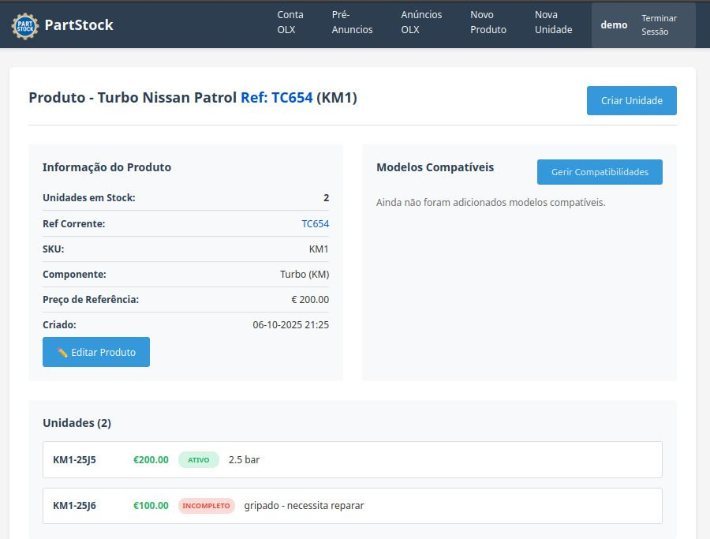
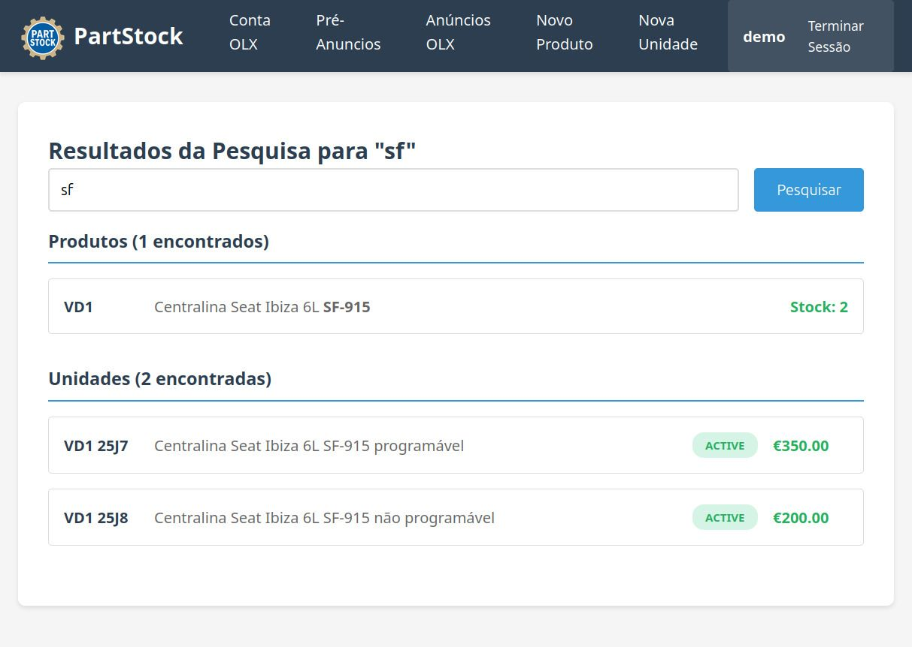
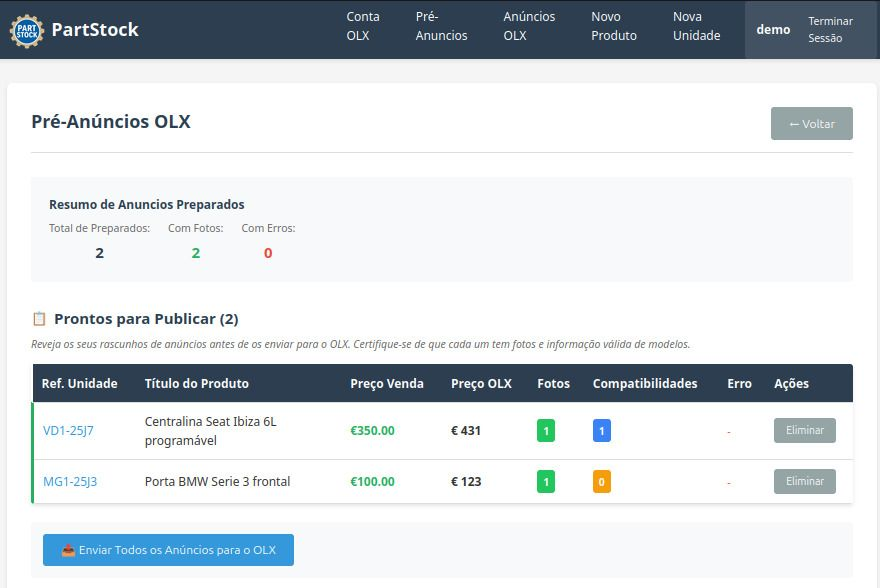
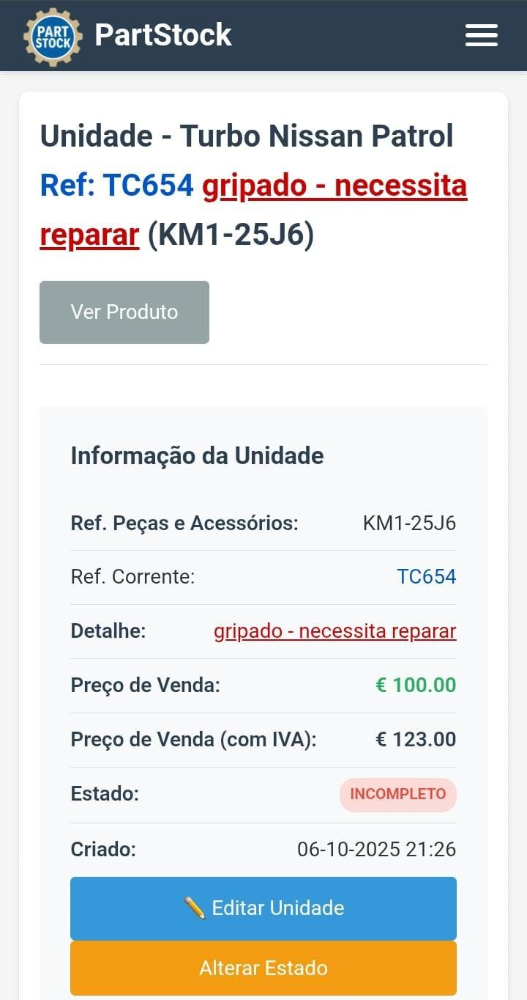

# PartStock - Inventory & Marketplace Integration System

Production inventory management system for used auto parts business with OLX marketplace automation.

**Note**: This repository showcases the system architecture and design. Source code is proprietary.

Demo: https://partstock.xyz

## Business Impact

- Managing **2000+ inventory units** across **1400+ product types**
- **50% sales growth** through OLX marketplace automation in first month
- Real production system in daily business operations
- Streamlined workflow from inventory to online sales

## Key Features

- **Product & Unit Management**: Complete inventory control with photo handling and detailed specifications
- **OLX Integration**: Bulk advertisement creation and publishing to OLX marketplace
- **Advanced Search**: Fast search across products and inventory units
- **Mobile Responsive**: Full functionality on mobile devices
- **Role-Based Access**: Multi-user system with permission controls
- **Audit Logging**: Complete tracking of inventory changes and operations

## Tech Stack

**Backend**
- Python 3.12
- FastAPI framework
- SQLAlchemy ORM
- SQLite database

**Infrastructure**
- Docker containerization
- nginx reverse proxy
- Cloudflare Tunnel (secure external access)
- Cloudflare R2 (photo storage)

**Frontend**
- Jinja2 templates
- Responsive CSS
- Mobile-first design

**External API**
- OLX Partner API integration

## System Overview

The system handles the complete workflow for a used auto parts business:

1. **Inventory Management**: Register products with technical specifications, photos, and reference codes
2. **Unit Tracking**: Individual inventory units with status, pricing, and conditions
3. **OLX Automatio**Note**: This repository showcases the system architecture and design. Source code is proprietary.n**: Select units, prepare advertisements, and publish in bulk to OLX marketplace
4. **Search & Discovery**: Quick lookup by reference codes, vehicle compatibility, or component names

## Screenshots

### Product Management

*Product view showing units in stock, compatibility management, and specifications*

### Search Functionality

*Fast search returning both products and individual units*

### OLX Integration

*Pre-publication review showing prepared advertisements with validation*

### Mobile Interface

*Responsive design for mobile inventory management*

## Architecture Highlights

- **Layered Architecture**: Clear separation between API, business logic, and data layers
- **Photo Management**: Cloudflare R2 integration with thumbnail generation
- **Database Design**: Relational model with vehicle compatibility (Make → Model), product hierarchy (Category → SubCategory → Component), and inventory tracking
- **API Integration**: OAuth2 flow with OLX Partner API for marketplace operations
- **Security**: role-based permissions, audit logging

## Database Schema (simplified)

Core entities:
- **Make/Model**: Vehicle compatibility database (175 makes, 6,000+ models)
- **Category/SubCategory/Component**: Product hierarchy (5 categories, 11 subcategories, 117 components)
- **Product**: Generic product definition with specifications
- **Unit**: Individual inventory items with status and pricing
- **OLX Integration**: Draft management and publication tracking

---